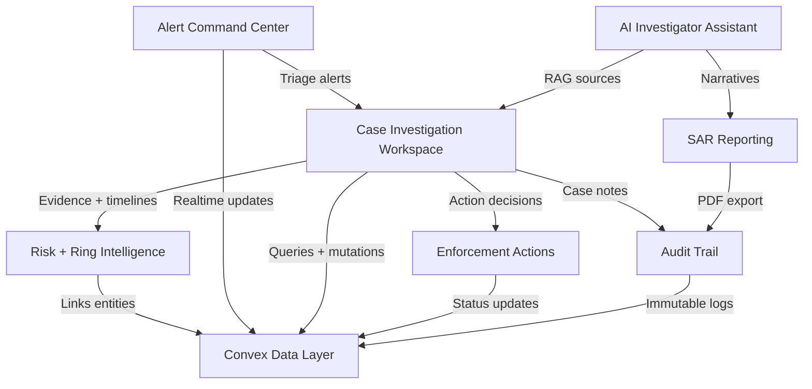

# CasePilot Architecture Snapshot

```mermaid
flowchart TB
	subgraph Client[Next.js App Router]
		UI[Alerts + Cases UI]
		Chat[Chat Widget]
		Reports[PDF Export]
		Maps[Maps + Charts]
		UI --> Chat
		UI --> Maps
		UI --> Reports
	end

	subgraph API[Next.js API Routes]
		ChatRoute[/api/chat]
		SarRoute[/api/sar]
	end

	subgraph Convex[Convex Backend]
		Queries[Queries: alerts, cases]
		Mutations[Mutations: actions]
		Actions[Actions: SAR generation]
		Scheduler[Scheduler: attack injection]
		Data[Tables: users, alerts, cases, actions, entities, links, messages, evidence]
		Queries --> Data
		Mutations --> Data
		Actions --> Data
		Scheduler --> Data
	end

	subgraph AI[AI Services]
		LLM[OpenRouter LLM]
		Embed[Embeddings + Vector Search]
	end

	UI -->|Convex hooks| Queries
	UI -->|Convex hooks| Mutations
	Chat -->|Message stream| ChatRoute
	ChatRoute -->|RAG context| Queries
	ChatRoute -->|Prompt + tools| LLM
	ChatRoute -->|Sources| Embed
	SarRoute -->|Generate narrative| Actions
	Actions -->|LLM call| LLM
	Reports -->|Client PDF| SarRoute
	Embed --> Data

	UI -->|Realtime updates| Queries
	Scheduler -->|Inject alerts| Mutations
```

## Feature Map


